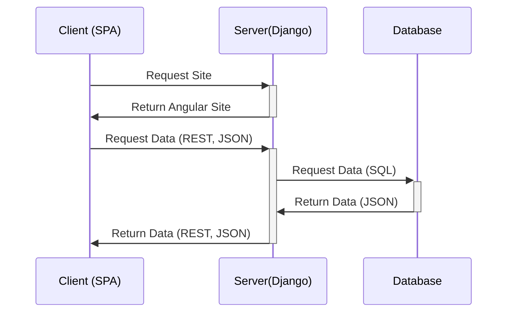
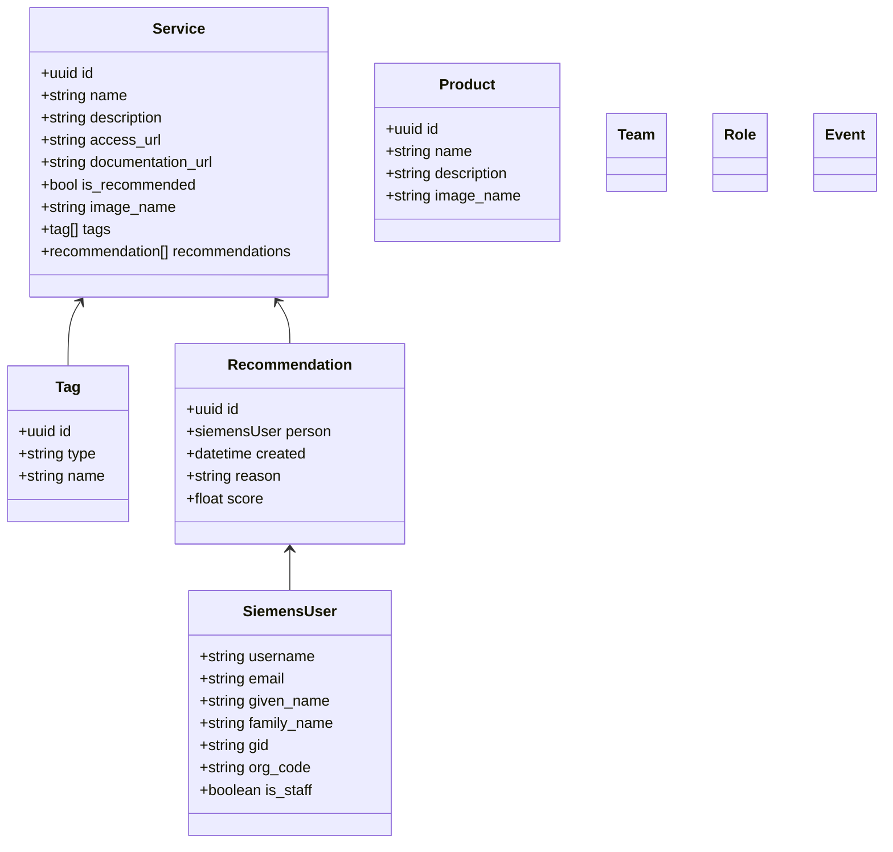
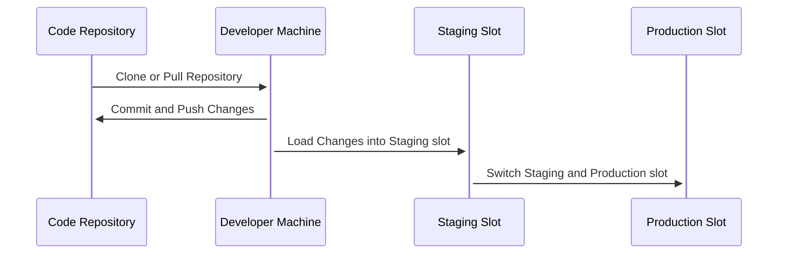

# DAC Starting Page

URL: https://discovery.dainsights.public.siemens.com

API Endpoint: https://discovery.dainsights.public.siemens.com/api


# Architecture and Code

## Frontend and Backend Code

```
┌───────────────────┐           ┌──────────────────────┐    ┌──────────────────────┐
│     Frontend      │           │        Backend       │    │       Database       │
│                   │           │                      │    │   Azure SQL Server   │
│      Angular      │           │       Django         │    │                      │
│         +         │           │          +           │    │                      │
│     TypeScript    │           │       Python         │    └──────────────────────┘
│                   │           │                      │    ┌──────────────────────┐
│                   │           │                      │    │     Image Blob       │
│                   │           │    Azure Appservice  │    │     Azure Storage    │
│                   │           │                      │    │                      │
│                   │           │                      │    └──────────────────────┘
│                   │           │                      │
│                   │           │                      │
│                   │           │                      │
│                   │           │                      │
└───────────────────┘           └──────────────────────┘
```


## Flow of Information


## Models and Data Structure



## Frontend Structure

The frontend is based on Angular using the Siemens Brand version of (SiMPL)[https://simpl.code.siemens.io/simpl-siemens-brand/].
All code is in the mysite/angular-frontend folder.  
The Angular Code is structured into
- Components -> Visual and functional code for displaying data 
- Interfaces -> Definition of data classes (used for definition of frontend model classes)
- Services -> Code to call rest endpoint with Rest Requests


# Deployment



## Important Information:
-  Static Assets need to be collected before changes are loaded into staging slot : `python manage.py collectstatic` [Docs](https://docs.djangoproject.com/en/4.2/ref/contrib/staticfiles/) 
